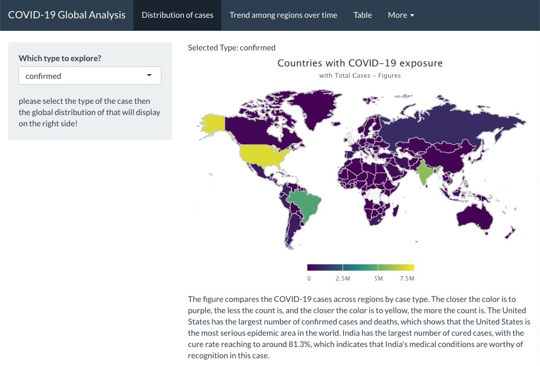

<!-- README.md is generated from README.Rmd. Please edit that file -->

```{r, include = FALSE}
knitr::opts_chunk$set(
  collapse = TRUE,
  comment = "#>",
  fig.path = "man/figures/README-",
  out.width = "100%"
)
```

# COVID19bb

<!-- badges: start -->
[](https://github.com/etc5523-2020/r-package-assessment-Yiwen-Zhang-259/actions)
[](https://www.gnu.org/licenses/gpl-3.0)
<!-- badges: end -->


## Introduction

The goal of `COVID19bb` package, which is created by Yiwen Zhang, is to provide the relevant datasets and functions to run the COVID-19 Global Analysis Shiny Application. 
And the aim of the COVID-19 Global Analysis Shiny Application is to provide a concise and visual appealing way to explore the epidemic condition of the COVID-19.

The package consists of three datasets:

- `covid_19_all` : contains daily epidemic information of COVID-19 for 215 countries or regions, from 2020-01-22 to 2020-10-03.
- `covid_19_data`: contains daily epidemic information of COVID-19 for 222 countries or regions, from 2020-01-22 to 2020-09-24.
- `worldgeojson` : is the world map in geojson format (list).

And there are three functions: 

- `select_input` : help users select input object within the Shiny Application.
- `table_filter` : create a table after filtering with daily cases of COVID-19.
- `launch_app` : launch the COVID-19 Global Analysis Shiny Application from the `COVID19bb` package.

## Installation

<!--You can install the released version of COVID19bb from [CRAN](https://CRAN.R-project.org) with: -->

<!-- ``` r -->
<!-- install.packages("COVID19bb") -->
<!--  ```  -->

And the development version from [GitHub](https://github.com/) with:

``` r
# install.packages("devtools")
devtools::install_github("etc5523-2020/r-package-assessment-Yiwen-Zhang-259")
```

### Launch the app

```{r launchapp, eval=FALSE}
launch_app()
```

### Shiny Application User Interface

Here are the UI of three main subpages:




## Example

### The dataset in package
This is a basic example which shows you the first five lines in `covid_19_all` data in this package:

```{r example, echo=FALSE, warning=FALSE}
library(COVID19bb)
library(kableExtra)

data(covid_19_all)

covid_19_all %>% 
  head(5) %>%
kable(booktabs = TRUE, caption = "COVID-19 Cases") 

## basic example code
```

### The case trend in Hubei province
This is a basic example which shows you how to explore the case trend of COVID-19 in the whole world.

```{r trend, echo=FALSE, warning=FALSE}
library(COVID19bb)
library(ggplot2)

    ggplot(data = covid_19_all) +
      geom_line(data = covid_19_all, aes(x = date, y = recovered), color = "green") +
      geom_line(data = covid_19_all, aes(x = date, y = deaths), color = "red") +
      geom_line(data = covid_19_all, aes(x = date, y = confirmed), color = "yellow") +
      ggtitle("Comparing COVID-19 trends across regions globally over time") +
      xlab('Dates') +
      ylab('Cases') 
```


## Data Source

The dataset in this package is from:

* [highcharter v0.8.2]<https://code.highcharts.com/mapdata/custom/world.js >
* [World Health Organization]<https://www.who.int/emergencies/diseases/novel-coronavirus-2019>
* [COVID19 Daily Updates]<https://www.kaggle.com/gpreda/coronavirus-2019ncov>
