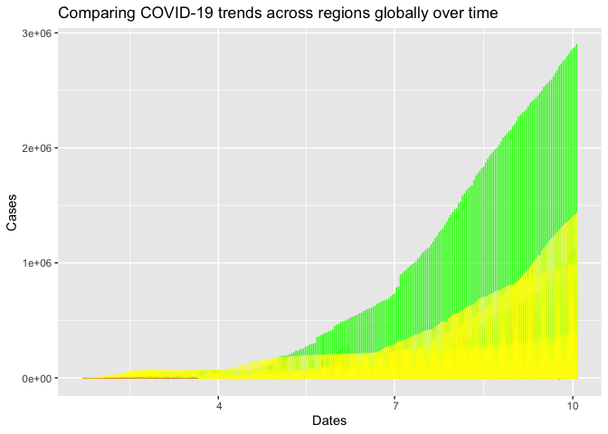

<!-- README.md is generated from README.Rmd. Please edit that file -->

# COVID19bb

<!-- badges: start -->

[](https://github.com/etc5523-2020/r-package-assessment-Yiwen-Zhang-259/actions)
[](https://www.gnu.org/licenses/gpl-3.0)
<!-- badges: end -->

## Introduction

The goal of `COVID19bb` package, which is created by Yiwen Zhang, is to
provide the relevant datasets and functions to run the COVID-19 Global
Analysis Shiny Application. And the aim of the COVID-19 Global Analysis
Shiny Application is to provide a concise and visual appealing way to
explore the epidemic condition of the COVID-19.

The package consists of three datasets:

  - `covid_19_all` : contains daily epidemic information of COVID-19 for
    215 countries or regions, from 2020-01-22 to 2020-10-03.
  - `covid_19_data`: contains daily epidemic information of COVID-19 for
    222 countries or regions, from 2020-01-22 to 2020-09-24.
  - `worldgeojson` : is the world map in geojson format (list).

And there are three functions:

  - `ui_input` : help users select input object within the Shiny
    Application.
  - `server_output` : create a distribution map of desired objects.
  - `launch_app` : launch the COVID-19 Global Analysis Shiny Application
    from the `COVID19bb` package.

## Installation

<!--You can install the released version of COVID19bb from [CRAN](https://CRAN.R-project.org) with: -->

<!-- ``` r -->

<!-- install.packages("COVID19bb") -->

<!--  ```  -->

And the development version from [GitHub](https://github.com/) with:

``` r
# install.packages("devtools")
devtools::install_github("etc5523-2020/r-package-assessment-Yiwen-Zhang-259")
```

### Launch the app

``` r
launch_app()
```

### Shiny Application User Interface

Here are the UI of three main subpages:


 

## Example

### The dataset in package

This is a basic example which shows you the first five lines in
`covid_19_all` data in this package:

    #> Registered S3 method overwritten by 'quantmod':
    #>   method            from
    #>   as.zoo.data.frame zoo

<table>

<caption>

COVID-19 Cases

</caption>

<thead>

<tr>

<th style="text-align:left;">

country\_region

</th>

<th style="text-align:left;">

province\_state

</th>

<th style="text-align:right;">

confirmed

</th>

<th style="text-align:right;">

recovered

</th>

<th style="text-align:right;">

deaths

</th>

<th style="text-align:left;">

date

</th>

</tr>

</thead>

<tbody>

<tr>

<td style="text-align:left;">

China

</td>

<td style="text-align:left;">

Hubei

</td>

<td style="text-align:right;">

444

</td>

<td style="text-align:right;">

28

</td>

<td style="text-align:right;">

17

</td>

<td style="text-align:left;">

2020-01-22

</td>

</tr>

<tr>

<td style="text-align:left;">

China

</td>

<td style="text-align:left;">

Hubei

</td>

<td style="text-align:right;">

444

</td>

<td style="text-align:right;">

28

</td>

<td style="text-align:right;">

17

</td>

<td style="text-align:left;">

2020-01-23

</td>

</tr>

<tr>

<td style="text-align:left;">

China

</td>

<td style="text-align:left;">

Hubei

</td>

<td style="text-align:right;">

549

</td>

<td style="text-align:right;">

31

</td>

<td style="text-align:right;">

24

</td>

<td style="text-align:left;">

2020-01-24

</td>

</tr>

<tr>

<td style="text-align:left;">

China

</td>

<td style="text-align:left;">

Hubei

</td>

<td style="text-align:right;">

761

</td>

<td style="text-align:right;">

32

</td>

<td style="text-align:right;">

40

</td>

<td style="text-align:left;">

2020-01-25

</td>

</tr>

<tr>

<td style="text-align:left;">

China

</td>

<td style="text-align:left;">

Hubei

</td>

<td style="text-align:right;">

1058

</td>

<td style="text-align:right;">

42

</td>

<td style="text-align:right;">

52

</td>

<td style="text-align:left;">

2020-01-26

</td>

</tr>

</tbody>

</table>

### The case trend in Hubei province

This is a basic example which shows you how to explore the case trend of
COVID-19 in the whole world.



## Data Source

The dataset in this package is from:

  - \[highcharter
    v0.8.2\]\<<https://code.highcharts.com/mapdata/custom/world.js> \>
  - \[World Health
    Organization\]<https://www.who.int/emergencies/diseases/novel-coronavirus-2019>
  - \[COVID19 Daily
    Updates\]<https://www.kaggle.com/gpreda/coronavirus-2019ncov>
